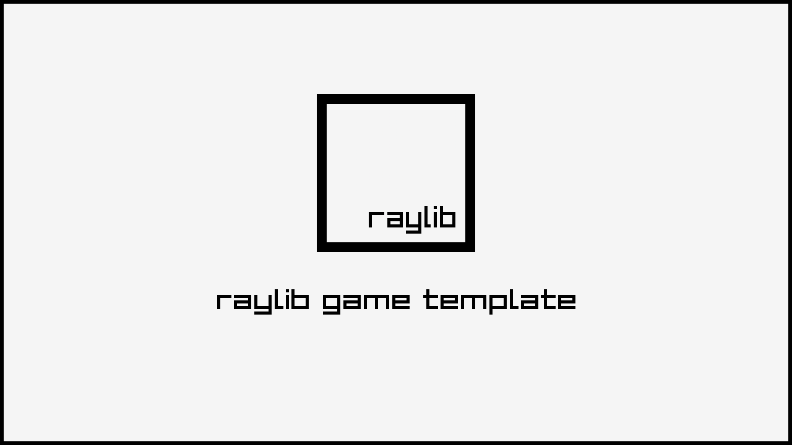

### Windows: Visual Studio

- After extracting the zip, the parent folder `raylib-game-template` should exist in the same directory as `raylib` itself.  So, your file structure should look like this:
    - Some parent directory
        - `raylib`
            - the contents of https://github.com/raysan5/raylib
        - `raylib-game-template`
            - this `README.md` and all other raylib-game-template files
- If using Visual Studio, open projects/VS2022/raylib-game-template.sln
- Select on `raylib_game` in the solution explorer, then in the toolbar at the top, click `Project` > `Set as Startup Project`
- Now you're all set up!  Click `Local Windows Debugger` with the green play arrow and the project will run.

### Linux

When setting up this template on linux for the first time, install the dependencies from this page:
([Working on GNU Linux](https://github.com/raysan5/raylib/wiki/Working-on-GNU-Linux))

You can use this templates in a few ways: using Visual Studio, using CMake, or make your own build setup. This repository comes with Visual Studio and CMake already set up.

Chose one of the follow setup options that fit in you development environment.

### CLI: Makefile

```sh
mkdir ~/raylib-gamejam && cd ~/raylib-gamejam
git clone --depth 1 --branch 6.0 https://github.com/raysan5/raylib
make -C raylib/src
git clone https://github.com/$(User Name)/$(Repo Name).git
cd $(Repo Name)
make -C src
src/raylib_game
```

This template has been created to be used with raylib (www.raylib.com) and it's licensed under an unmodified zlib/libpng license.

_Copyright (c) 2014-2026 Ramon Santamaria ([@raysan5](https://github.com/raysan5))_

-----------------------------------

# Hex&Merge

## Description
Still figuring out what the game will be about:
- Factory-style game where resources are not the traditional real-world resources we expect from other game in the genre
- A story driven main campaign where the ultimate goal is **NOT** to launch anything into space (maybe?)
- Humour... as much as I can come up with
## Features
 - Freeform movement
 - Hexagonal map
 - Systemic gameplay
 - 
## Controls
Keyboard:
 - `WASD` move
 - `E` interact
 - $(Game Control 03)
## Screenshots
_TODO: Show your game to the world, animated GIFs recommended!._
## Developers
 - GreenMoonMoon - *everyting(for now)*
### Links
### License
*Copyright (c) 2026 Josue Boisvert*
